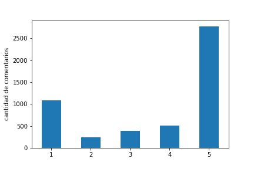
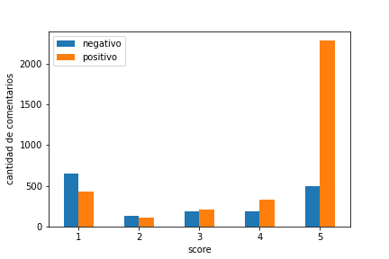

# Análisis de Sentimientos de las 'Calificaciones y opiniones' de Among Us en la Google Play Store
Este proyecto es parte del Trabajo Final del curso 'Procesamiento de Lenguaje Natural' de 'DataScience.pe' dictado por María Isabel Limaylla. Consiste en crear un modelo que clasifique los comentarios del juego Among Us en la Google Play Store entre 'positivo' (1) y 'negativo' (0).

## Reporte
Para acceder al reporte completo dar [click aquí](https://github.com/mauricioalvaradoo/sentiment_analysis_among_us/blob/master/Reporte/main.pdf).

## Pasos
### 1. Obtención de los datos
[Click](https://github.com/mauricioalvaradoo/sentiment_analysis_among_us/blob/master/1.%20Data.py)
Para el entrenamiento de los modelos se necesitó el dataset traducido del Corpus Stanford Sentiment Treebank (SST-2). Con esos mismos datos se realizó el testeo.

Además, aunque para el final, se necesita los comentarios que se clasificarán.

### 2. Creación y comparación de modelos
[Click](https://github.com/mauricioalvaradoo/sentiment_analysis_among_us/blob/master/2.%20Models.py)
Se comparó tres modelos en búsqueda del que consiga (i) la menor función de costos, (ii) el mayor F1-score y (iii) el mayor área debajo de curva ROC.

Los modelos son los siguientes:
1. Regresión Logística
2. Red Neuronal Convolucional Básica
3. Red Neuronal Convolucional Intermedia

Para el caso de la Regresión Logística se adoptó la asignación del hiperparámetro de regularización que alcanzó el mayor ajuste con los datos de entrenamiento entre 6 cantidatos y mediante GridSearchCV.

### 3. Revisión de las estadísticas
[Click](https://github.com/mauricioalvaradoo/sentiment_analysis_among_us/blob/master/3.%20Statistics.py)
Las principales estadísticas de la base de datos de los comentarios de _Among Us_ son las siguientes:
* Total de observaciones: 5 000
* Total de palabras: 38 227
* Cantidad de verbos: 9 921
* Cantidad de adjetivos: 8 582

Las comentarios por _score_ son los siguientes:

  

### 4. Clasificación de comentarios
[Click](https://github.com/mauricioalvaradoo/sentiment_analysis_among_us/blob/master/4.%20Classification.py)
Finalmente, la clasificación de los comentarios se realizaron con la Regresión Logística. Como no se cuenta con qué comparar y saber si la asignación fue correcta se realizó con los _scores_. Debido a que es razonable esperar que un comentario positivo esté asociado a un alto _score_ y uno negativo con uno bajo, se encuentra que: (i) el modelo es muy acertado para asignar comentarios positivos, pero (ii) es muy impreciso para asignar negativos, y hay mucha incertidumbre en estos.

  

